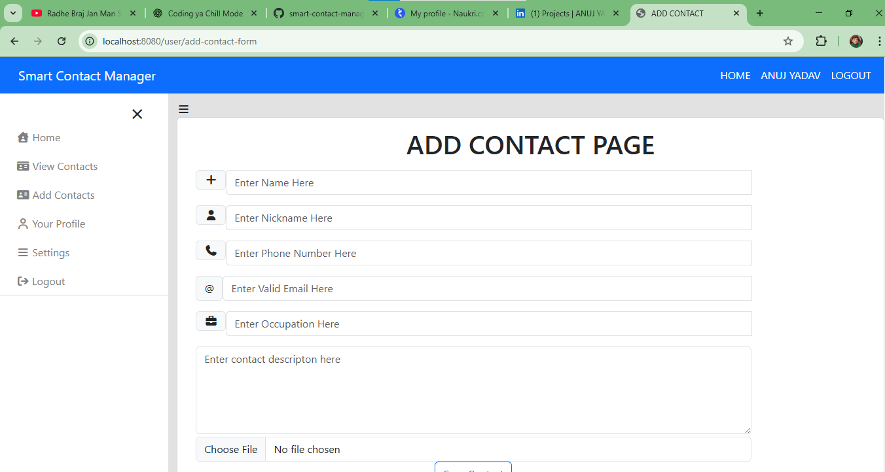

# Smart Contact Manager

A Spring Boot based backend application to manage user contacts with authentication,
CRUD operations, image upload, and MySQL database integration.

## 🚀 Features
- User registration and login (Spring Security)
- Add, update, delete contacts
- Upload and store contact images
- Secure authentication and authorization
- RESTful APIs
- MySQL database integration

## 🛠 Tech Stack
- Java
- Spring Boot
- Spring MVC
- Spring Security
- MySQL
- HTML, CSS, JavaScript
- Maven
- Git & GitHub

## 📂 Project Structure
- Controller Layer
- Service Layer
- Repository (JPA)
- Entity Layer
- Configuration & Security

## ⚙️ How to Run the Project
1. Clone the repository  
 
git clone https://github.com/Anuj-2770/smart-contact-manager.git

## 📸 Screenshots

### Login Page  
  
🔗 [View Image](screenshots/login.png)

### Home Page  
  
🔗 [View Image](screenshots/home.png)

### User Dashboard  
  
🔗 [View Image](screenshots/userdashboard.png)

### Add Contact  
  
🔗 [View Image](screenshots/addcontact.png)

